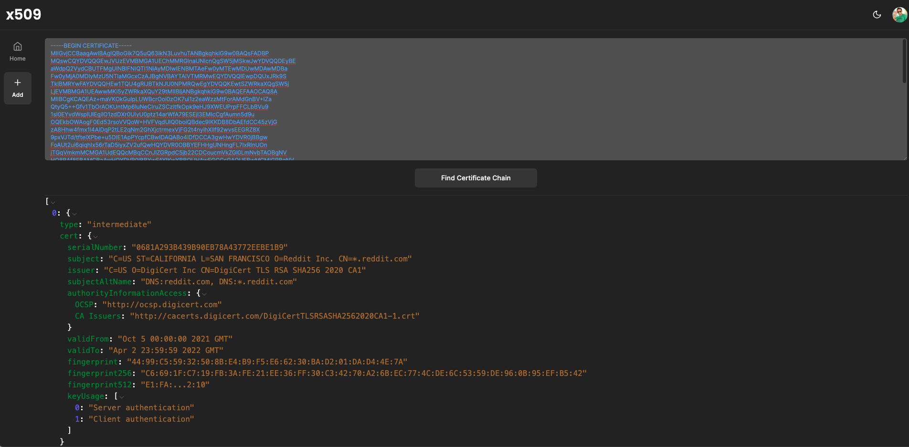
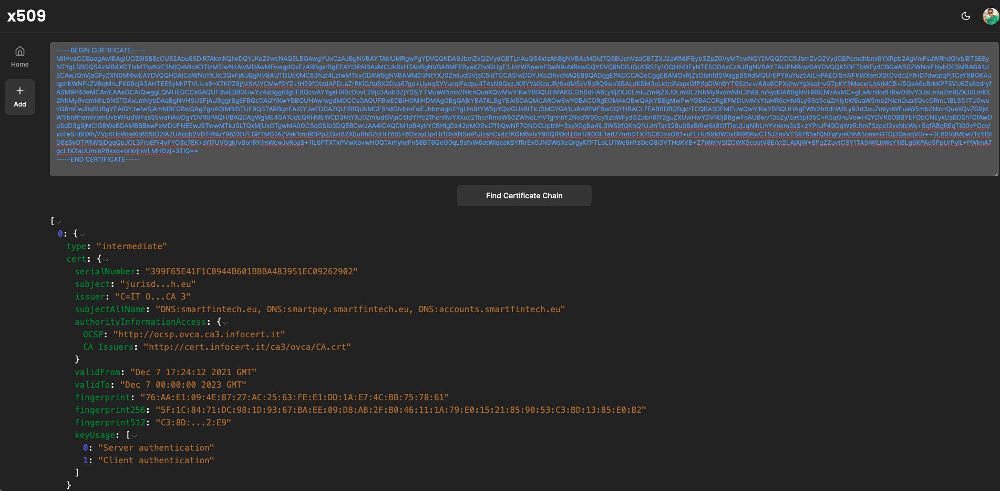
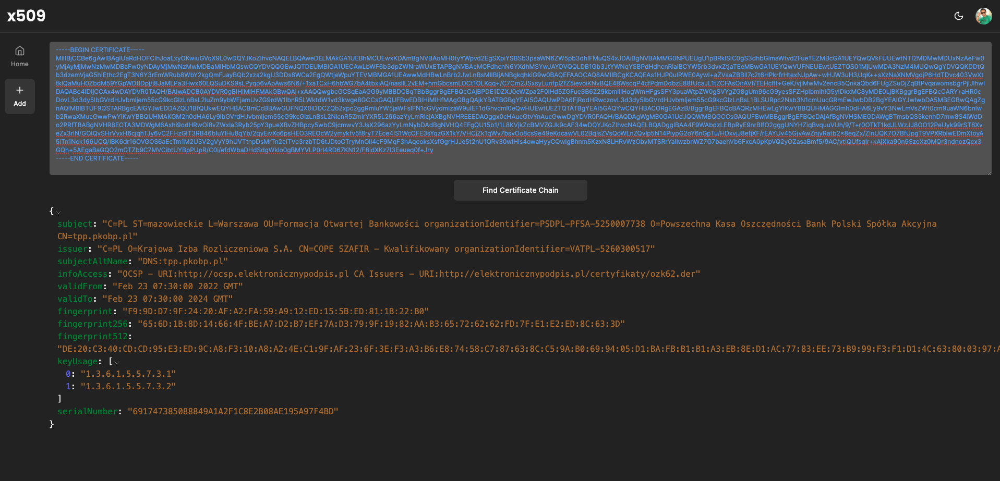

# X509

## Example Certificate

```pem
-----BEGIN CERTIFICATE-----
MIIGvjCCBaagAwIBAgIQBoGik7Q5uQ63ikN3LuvhuTANBgkqhkiG9w0BAQsFADBP
MQswCQYDVQQGEwJVUzEVMBMGA1UEChMMRGlnaUNlcnQgSW5jMSkwJwYDVQQDEyBE
aWdpQ2VydCBUTFMgUlNBIFNIQTI1NiAyMDIwIENBMTAeFw0yMTEwMDUwMDAwMDBa
Fw0yMjA0MDIyMzU5NTlaMGcxCzAJBgNVBAYTAlVTMRMwEQYDVQQIEwpDQUxJRk9S
TklBMRYwFAYDVQQHEw1TQU4gRlJBTkNJU0NPMRQwEgYDVQQKEwtSZWRkaXQgSW5j
LjEVMBMGA1UEAwwMKi5yZWRkaXQuY29tMIIBIjANBgkqhkiG9w0BAQEFAAOCAQ8A
MIIBCgKCAQEAz+maVKOkGuIpLUWBcrOoi0zOK7ui1z2eaWzzMtForAMdGnBV+IZa
QtyQ5++Gfv1TbOrAOKUntMp6luNeClruZSCzltfkOpk9eHJ9XWEUPrpFFCLbBVu9
1sl0EYvdWsplUlEgilO1zdDXr0UiyU0ptz14arWfA79ESEjl3EMIcCgfAumn5d9u
OQEkbOWAogF0Ed53rsoVVQoW+HVFVqdUlQ0boiQBdec9lKKDB8DbAEfdCC45zVjG
zA8Hhw4fmx1l4AlDqP2tLE2qNm2GhXjctrmexVjFG2t4nyihXllf92wvsEEGRZ8X
9pxVJTd/tfteIXPbe+u5DIE1ApPYcpfCBwIDAQABo4IDfDCCA3gwHwYDVR0jBBgw
FoAUt2ui6qiqhIx56rTaD5iyxZV2ufQwHQYDVR0OBBYEFHHgUNHngFL7IxRlnUOn
jTGqVmkmMCMGA1UdEQQcMBqCCnJlZGRpdC5jb22CDCoucmVkZGl0LmNvbTAOBgNV
HQ8BAf8EBAMCBaAwHQYDVR0lBBYwFAYIKwYBBQUHAwEGCCsGAQUFBwMCMIGPBgNV
HR8EgYcwgYQwQKA+oDyGOmh0dHA6Ly9jcmwzLmRpZ2ljZXJ0LmNvbS9EaWdpQ2Vy
dFRMU1JTQVNIQTI1NjIwMjBDQTEtNC5jcmwwQKA+oDyGOmh0dHA6Ly9jcmw0LmRp
Z2ljZXJ0LmNvbS9EaWdpQ2VydFRMU1JTQVNIQTI1NjIwMjBDQTEtNC5jcmwwPgYD
VR0gBDcwNTAzBgZngQwBAgIwKTAnBggrBgEFBQcCARYbaHR0cDovL3d3dy5kaWdp
Y2VydC5jb20vQ1BTMH8GCCsGAQUFBwEBBHMwcTAkBggrBgEFBQcwAYYYaHR0cDov
L29jc3AuZGlnaWNlcnQuY29tMEkGCCsGAQUFBzAChj1odHRwOi8vY2FjZXJ0cy5k
aWdpY2VydC5jb20vRGlnaUNlcnRUTFNSU0FTSEEyNTYyMDIwQ0ExLTEuY3J0MAwG
A1UdEwEB/wQCMAAwggF/BgorBgEEAdZ5AgQCBIIBbwSCAWsBaQB3ACl5vvCeOTkh
8FZzn2Old+W+V32cYAr4+U1dJlwlXceEAAABfFC72CcAAAQDAEgwRgIhAOPvkGqz
OfXSiPNKqhmsc0c7M21/QkrpN1hcI4V20ttLAiEAhqdnqhRwbHLCM+tU3okCDOx0
PV5LtF7e96gYK90TvbYAdwBRo7D1/QF5nFZtuDd4jwykeswbJ8v3nohCmg3+1IsF
5QAAAXxQu9gNAAAEAwBIMEYCIQC+O/YXHqd5PEjBJXYXIVW1VminlyF+3zNnPX1O
5fKEXQIhALCTn2R0W9ru9zNIKgXbQ+eWVA45kpLSfLvo2GJe9i5MAHUAQcjKsd8i
RkoQxqE6CUKHXk4xixsD6+tLx2jwkGKWBvYAAAF8ULvXsgAABAMARjBEAiBjxvP+
oo6SQ8pqoXSiunzRoO32V8mCSq7H+Q8TkqQrugIgJEFPFIrGZme9HncBIOHDzJXO
A+OhGc5/x3mJWW/IuEEwDQYJKoZIhvcNAQELBQADggEBABC4VDLWAFqbVjb85A/O
vn3S/I5Pv8+oOMMBZgEwh58EAxwdy0MCSjdQ5G5vrYRk7a3jtq0SNtVNIqgu722M
CyGb8lVv7Sc1AP4OHK/BpoBiLFf9vNlufBhnbg9eortk50qYUdW2/Qr8FRryv+cX
LJCXqwSqXEjWVq7b2y48bP5QkFIsGe5acxbGGtYN8hu9cXDWfHcGYPgmGYYTqJIW
7Gz6UCApMZXSA5iqIA7TWphkQJiOQut445kd60IdFwm307Wb9YoZ+h9cFHUkQWgX
35sxnmCoOR/3NzgFGwS+8E9zRUDCYldcCu7a01L3/EPZjtfKWwzKpSnCzEqJs2ZB
1sg=
-----END CERTIFICATE-----
```

Certificate Chain

```json
[
  {
    "type": "intermediate",
    "cert": {
      "serialNumber": "0681A293B439B90EB78A43772EEBE1B9",
      "subject": "C=US\nST=CALIFORNIA\nL=SAN FRANCISCO\nO=Reddit Inc.\nCN=*.reddit.com",
      "issuer": "C=US\nO=DigiCert Inc\nCN=DigiCert TLS RSA SHA256 2020 CA1",
      "subjectAltName": "DNS:reddit.com, DNS:*.reddit.com",
      "authorityInformationAccess": {
        "OCSP": "http://ocsp.digicert.com",
        "CA Issuers": "http://cacerts.digicert.com/DigiCertTLSRSASHA2562020CA1-1.crt"
      },
      "validFrom": "Oct  5 00:00:00 2021 GMT",
      "validTo": "Apr  2 23:59:59 2022 GMT",
      "fingerprint": "44:99:C5:59:32:50:8B:E4:B9:F5:E6:62:30:BA:D2:01:DA:D4:4E:7A",
      "fingerprint256": "C6:69:1F:C7:19:FB:3A:FE:21:EE:36:FF:30:C3:42:70:A2:6B:EC:77:4C:DE:6C:53:59:DE:96:0B:95:EF:B5:42",
      "fingerprint512": "E1:FA:D2:E3:53:A7:BC:F4:44:5D:5E:4E:4D:AC:00:C5:05:05:C6:57:1E:56:6A:6D:65:62:57:C9:D2:75:12:E9:A2:F5:8D:31:8D:0E:54:C6:47:2E:A4:FE:F2:40:76:AB:4A:BC:E0:27:7B:76:30:8A:6E:1D:78:2E:EB:AD:42:10",
      "keyUsage": ["Server authentication", "Client authentication"]
    }
  },
  {
    "type": "intermediate",
    "cert": {
      "serialNumber": "06D8D904D5584346F68A2FA754227EC4",
      "subject": "C=US\nO=DigiCert Inc\nCN=DigiCert TLS RSA SHA256 2020 CA1",
      "issuer": "C=US\nO=DigiCert Inc\nOU=www.digicert.com\nCN=DigiCert Global Root CA",
      "authorityInformationAccess": {
        "OCSP": "http://ocsp.digicert.com",
        "CA Issuers": "http://cacerts.digicert.com/DigiCertGlobalRootCA.crt"
      },
      "validFrom": "Apr 14 00:00:00 2021 GMT",
      "validTo": "Apr 13 23:59:59 2031 GMT",
      "fingerprint": "1C:58:A3:A8:51:8E:87:59:BF:07:5B:76:B7:50:D4:F2:DF:26:4F:CD",
      "fingerprint256": "52:27:4C:57:CE:4D:EE:3B:49:DB:7A:7F:F7:08:C0:40:F7:71:89:8B:3B:E8:87:25:A8:6F:B4:43:01:82:FE:14",
      "fingerprint512": "E1:51:D7:CE:56:14:48:00:49:DC:A3:87:39:2C:24:2B:CD:3A:1C:6D:89:30:C8:8F:57:F6:12:36:9C:DA:BB:D2:7D:CC:4D:92:FD:02:57:56:F6:16:18:2F:29:DA:82:10:2C:14:52:1F:C6:DC:D7:A0:25:57:3F:BE:3A:DF:24:02",
      "keyUsage": ["Server authentication", "Client authentication"]
    }
  },
  {
    "type": "root",
    "cert": {
      "serialNumber": "083BE056904246B1A1756AC95991C74A",
      "subject": "C=US\nO=DigiCert Inc\nOU=www.digicert.com\nCN=DigiCert Global Root CA",
      "issuer": "C=US\nO=DigiCert Inc\nOU=www.digicert.com\nCN=DigiCert Global Root CA",
      "authorityInformationAccess": [],
      "validFrom": "Nov 10 00:00:00 2006 GMT",
      "validTo": "Nov 10 00:00:00 2031 GMT",
      "fingerprint": "A8:98:5D:3A:65:E5:E5:C4:B2:D7:D6:6D:40:C6:DD:2F:B1:9C:54:36",
      "fingerprint256": "43:48:A0:E9:44:4C:78:CB:26:5E:05:8D:5E:89:44:B4:D8:4F:96:62:BD:26:DB:25:7F:89:34:A4:43:C7:01:61",
      "fingerprint512": "53:B4:44:E5:65:18:32:01:A6:1E:EB:46:12:09:B2:DC:30:89:5E:EC:A4:87:23:8D:15:A0:26:73:5F:22:9A:81:9E:5B:19:CB:D7:E2:FA:27:68:AB:2A:64:F6:EB:CD:9D:1E:72:13:41:C9:ED:5D:D0:9F:C0:D5:E4:3D:68:BC:A7"
    }
  }
]
```

## Screenshot

Screenshot-3


Screenshot-2


Screenshot-1

